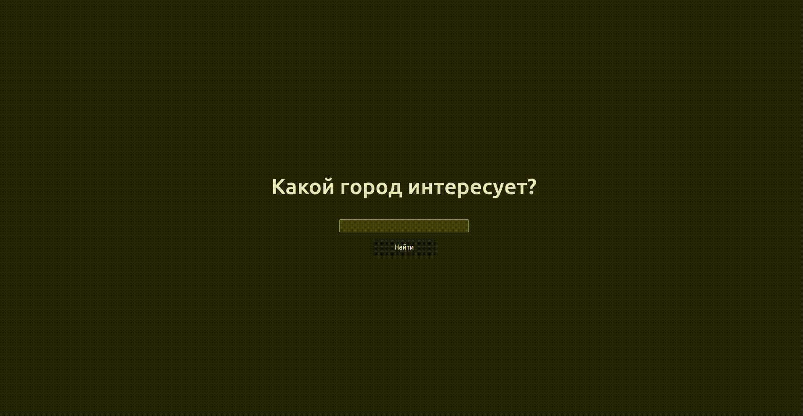

# Weather Forecast App

A simple single-page application for checking weather forecasts of a selected city. Built using **React**, **Vite**, and **TypeScript**, with weather data fetched from the **OpenWeather API**.

## Technologies Used

- React
- TypeScript
- Vite
- CSS (animations, responsive design)
- OpenWeather API

## Features

- Search for weather by city name
- Displays a forecast for the next 9 hours, including temperature, cloud coverage, and rainfall information
- Animations for weather cards' appearance
- Error handling for incorrect city names or API issues
- Provides detailed weather conditions (e.g., light rain, heavy rain, no rain)

## Demo

Here is a quick preview of the Weather Forecast App in action:

